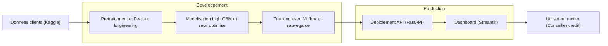
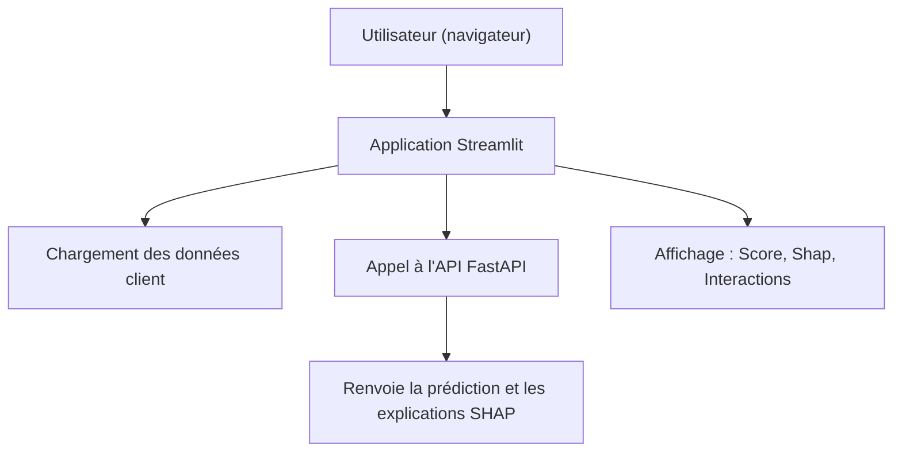

# 📊 Dashboard de scoring de risque de crédit - Projet "Prêt à Dépenser"

## 🌟 Objectif du projet
Ce projet vise à créer un outil d'aide à la décision pour les conseillers clientèle de l'organisme de prêt "Prêt à dépenser". L'objectif est d'évaluer le risque qu'un client présente un défaut de paiement afin d'aider à l'acceptation ou au refus d'une demande de crédit. Le modèle tient compte du fait qu'un faux négatif (accorder un crédit à un mauvais payeur) est beaucoup plus coûteux qu'un faux positif (refuser un bon payeur).

---

## 🧠 Approche Machine Learning

### 🔄 Données
- Jeux de données : 🔗 [Home Credit Default Risk – Home Credit Group](https://www.kaggle.com/c/home-credit-default-risk/data)
- Plus de **300 000 clients** avec 122 variables.
- Environ **8 %** de défauts de paiement.

### 🧬 Prétraitement et Feature Engineering
Une grande partie de l’inspiration pour l’ingénierie des features et l’approche LightGBM provient de ce notebook Kaggle :  
🔗 [LightGBM with Simple Features – jsaguiar](https://www.kaggle.com/code/jsaguiar/lightgbm-with-simple-features)
🔗 [6 Ways for Feature Selection – sz8416](https://www.kaggle.com/code/sz8416/6-ways-for-feature-selection)
- Nettoyage des données (valeurs aberrantes, outliers)
- LabelEncoding / OneHotEncoding des variables catégorielles
- Agrégations et création de nouvelles variables (ratios, différences, etc.)
- Normalisation et gestion des valeurs manquantes
- Feature selection

### 📊 Modèles testés
- DummyClassifier (baseline)
- Logistic Regression
- RandomForest
- Gradient Boosting
- XGBoost
- **LightGBM** (meilleur modèle)

### ⚖️ Optimisation
- **Métriques classiques** : AUC ROC, Accuracy, Recall, F1.
- **Score métier personnalisé** : `10 × FN + 1 × FP`, minimisé lors de l’optimisation du seuil.
- **Optimisation du seuil** via Stratified K-Fold (5 folds) : seuil optimal par fold, seuil final = moyenne des seuils optimaux.
- Pipeline encapsulé : SMOTE (train only, sampling_strategy=0.5) → StandardScaler → Modèle.


---

## 📈 Tracking & Expérimentation avec MLflow
- Enregistrement de tous les runs : hyperparamètres, métriques, temps d’exécution.
- `input_example` et `signature` pour chaque modèle logué.
- Enregistrement du meilleur modèle comme **Registered Model**.
- Fonction générique `run_single_model()` ou `log_to_mlflow()` pour automatiser le tracking.

---
## 🎉 Résultats
- Modèle final : **LightGBM + seuil optimisé**
- AUC ROC : 0.79+, Score métier : ~0.47 (sur jeu test)
- Interprétabilité intégrée + pipeline complet enregistré

---

## 🔍 Explicabilité
- **SHAP Values** : explicabilité locale et globale.
- Visualisations intégrées dans le dashboard Streamlit (force plots, bar plots, etc.).
- Présentation claire des variables influentes pour chaque client.

---

## 🤖 Analyse de la robustesse et du Data Drift
- Utilisation de **Evidently AI** pour comparer distributions entre train et production (ou jeu test simulant prod).
- **Résultat** : dérive détectée sur 8 colonnes sur 105 (~ 7,6 %), distances normalisées toutes < 0,36 (seuil critique non atteint).  
  - Colonnes principalement financières ou d’interaction client impactées (ex. AMT_CREDIT, AMT_ANNUITY, DAYS_LAST_PHONE_CHANGE…).
- **Conclusion** : pas de réentraînement urgent, mais surveillance continue conseillée sur ces variables sensibles.

---

## 🚀 Déploiement

### 🚧 Backend (API FastAPI)
- Endpoint `/predict` prenant en entrée les features validées par Pydantic, renvoyant probabilité et décision selon seuil.
- Endpoint `/explain` renvoyant valeurs SHAP.
- Chargement des artefacts (scaler, modèle, seuil) depuis joblib
- Containerisation via `Dockerfile.backend`, déploiement sur Render (ou autre).


##### 👁️ Frontend (Streamlit)
- Application Streamlit :  
  - Saisie/chargement d’un client (ID ou saisie manuelle des features).  
  - Affichage du score, de la décision (Accordé/Refusé).  
  - Visualisation explicative (SHAP).  
  - Comparaison avec population ou segments.  
- Configuration via `config.py` (URL API, seuil, etc.).  
- Containerisation via `Dockerfile.frontend`, déploiement sur Render.

### 🧪 CI/CD & Tests
- **Tests unitaires** avec `pytest` pour modules ML, utilitaires, et endpoints FastAPI (TestClient).  
- Rapport de couverture généré (`coverage run -m pytest` + `coverage html`) -> dossier `htmlcov/`.  
- **GitHub Actions** : 
  - CI : installation, lint, tests, génération du rapport coverage (artefact).  
  - CD : build des images Docker et déploiement automatique sur Render.

### 📊 MLOps
- Suivi des runs via MLflow, stockage centralisé des artefacts.
- Monitoring en production : intégrer métriques de latence, erreurs, et indicateurs de drift.
- Versioning du modèle et automatisation du re-déploiement lors d’un nouveau run validé.


---
## 🧩 Vue d’ensemble



## 📂 Structure du projet
```
dashboard-risk/
├── backend/           # API FastAPI, modèles et outils
├── frontend/          # Interface utilisateur Streamlit
├── assets/            # CSS et ressources
├── notebooks/         # Exploration et notebooks de travail
├── tests/             # Tests unitaires
├── requirements.txt   # Dépendances backend
├── environment.yml    # Environnement complet
└── README.md
```

---

## 🔧 Installation rapide
```bash
# 1. Cloner le projet
git clone https://github.com/NgHenri/dashboard-risk.git
cd dashboard-risk

# 2. Créer un environnement conda
conda env create -f environment.yml
conda activate dashboard-risk

# 3. Installer dépendances spécifiques si besoin
pip install -r backend/requirements.txt
pip install -r frontend/requirements.txt

# 4. Lancer les tests de couverture
pytest
coverage run -m pytest
coverage html   # générera ou mettra à jour htmlcov/

# 5. Démarrer l’API
cd backend
uvicorn main:app --reload --port 8000

# 6. Démarrer le dashboard
streamlit run frontend/app.py
```
---
## 🚀 Déploiement

#### A.Fast-API
- L'API FastAPI peut être déployée dans un conteneur Docker léger. Deux options sont proposées selon ton environnement d'hébergement
- -  🔧 Option 1 : Déploiement standard avec 🐳 Dockerfile.backend
- - - Utilisation classique pour un environnement local ou un serveur Docker standard.

##### 🧪 Build & Exécution locale

```bash
docker build -f Dockerfile.backend -t fastapi-backend .
docker run -p 8000:8000 fastapi-backend

```
- - ☁️ Option 2 : Déploiement sur Railway, Render ou Fly.io avec entrypoint.sh
```bash
docker build -f Dockerfile.backend -t fastapi-backend .
docker run -e PORT=10000 -p 10000:10000 fastapi-backend

```

Cette version est mieux adaptée aux plateformes cloud qui imposent une variable d’environnement PORT.

#### B. Streamlit

- L'application frontend est construite avec Streamlit. Elle peut être conteneurisée et déployée via Docker à l'aide d'une image légère.

- - Déploiement standard avec 🐳 Dockerfile.frontend
Utilisation classique pour un environnement local ou un serveur Docker standard.

##### 🧪 Build & Exécution locale
```bash
docker build -f Dockerfile.frontend -t streamlit-frontend .
docker run -p 8501:8501 streamlit-frontend
```
Une fois lancé, l’application sera accessible à l'adresse suivante :

```http
http://localhost:8501
```

## 🧭 Vue d'ensemble de l'application



## 🧭 Prochaines étapes possibles

    ✅ Mettre en place un reverse proxy (ex: NGINX) pour répartir les requêtes entre plusieurs instances backend.

    ✅ Intégrer un système d’authentification par API Key dans NGINX ou au niveau de l’API FastAPI.

    🔄 Implémenter la gestion de sessions utilisateurs (clé unique/token).
  -  Authentification et architecture avec NGINX
  ```mermaid
  flowchart TD
      U[Utilisateur] -->|Requête HTTP avec API Key| N[Serveur NGINX]

      subgraph Backend
          B1[FastAPI Backend #1]
          B2[FastAPI Backend #2]
      end

      N -->|Routage intelligent| B1
      N --> B2

      B1 -->|Réponse JSON| N
      B2 --> N
      N -->|Données traitées| F[Frontend Streamlit]

      F -->|Affichage Score, SHAP, etc.| U
  ```

    📈 Ajouter un système de monitoring :


        Pour les données : Evidently

        Pour l’infrastructure : Prometheus + Grafana

---


Pour toute question ou amélioration, n'hésitez pas à me contacter !

[](https://lightgbm.readthedocs.io/)

