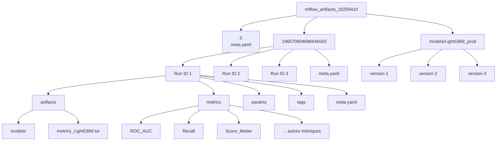

## 📦 MLflow Artifacts – mlflow_artifacts_20250410

Ce dossier contient les artefacts générés automatiquement lors des entraînements de modèles via MLflow. Il conserve toutes les métriques, hyperparamètres, artefacts et métadonnées associées à chaque run.

### 🗂️ Structure du dossier

```
mlflow_artifacts_20250410
.
├── 0/                               # Run d'exemple ou test vide (non exploité)│   └── meta.yaml
├── 196570904696646563               
│   ├── 966528018ddb43ca812562d0975c240d    # Dossier d’un run unique
│   │   ├── artifacts                       # Artéfacts produits par le run (modèle, fichiers de métriques, etc.)
│   │   │   ├── metrics_LightGBM.txt
│   │   │   └── models
│   │   ├── meta.yaml
│   │   ├── metrics                         # Fichiers de métriques calculées (AUC, recall, score métier, etc.)
│   │   │   ├── Accuracy
│   │   │   ├── Best_CV_AUC
│   │   │   ├── Best_CV_Custom
│   │   │   ├── Best_Threshold
│   │   │   ├── CV_AUC_mean
│   │   │   ├── CV_AUC_std
│   │   │   ├── CV_Custom_mean
│   │   │   ├── CV_Custom_std
│   │   │   ├── Confusion_Matrix_FN
│   │   │   ├── Confusion_Matrix_FP
│   │   │   ├── Confusion_Matrix_TN
│   │   │   ├── Confusion_Matrix_TP
│   │   │   ├── Execution_Time
│   │   │   ├── F1_Score
│   │   │   ├── Log_Loss
│   │   │   ├── Precision
│   │   │   ├── Prediction_Time_s
│   │   │   ├── ROC_AUC
│   │   │   ├── Recall
│   │   │   └── Score_Metier
│   │   ├── params
│   │   │   ├── classification__learning_rate
│   │   │   ├── classification__max_depth
│   │   │   ├── classification__n_estimators
│   │   │   ├── classification__num_leaves
│   │   │   ├── classification__reg_alpha
│   │   │   └── classification__reg_lambda
│   │   └── tags
│   │       ├── mlflow.log-model.history
│   │       ├── mlflow.note.content
│   │       ├── mlflow.runName
│   │       ├── mlflow.source.name
│   │       ├── mlflow.source.type
│   │       └── mlflow.user
│   ├── d36cc1867d60433aa5b5f66a9e33634e    # Dossier d’un run unique
│   │   ├── artifacts
│   │   │   ├── metrics_LightGBM.txt
│   │   │   └── models
│   │   ├── meta.yaml
│   │   ├── metrics
│   │   │   ├── Accuracy
│   │   │   ├── Best_CV_AUC
│   │   │   ├── Best_CV_Custom
│   │   │   ├── Best_Threshold
│   │   │   ├── CV_AUC_mean
│   │   │   ├── CV_AUC_std
│   │   │   ├── CV_Custom_mean
│   │   │   ├── CV_Custom_std
│   │   │   ├── Confusion_Matrix_FN
│   │   │   ├── Confusion_Matrix_FP
│   │   │   ├── Confusion_Matrix_TN
│   │   │   ├── Confusion_Matrix_TP
│   │   │   ├── Execution_Time
│   │   │   ├── F1_Score
│   │   │   ├── Log_Loss
│   │   │   ├── Precision
│   │   │   ├── Prediction_Time_s
│   │   │   ├── ROC_AUC
│   │   │   ├── Recall
│   │   │   └── Score_Metier
│   │   ├── params                              # Hyperparamètres utilisés pour l'entraînement
│   │   │   ├── classification__learning_rate
│   │   │   ├── classification__max_depth
│   │   │   ├── classification__min_child_samples
│   │   │   ├── classification__n_estimators
│   │   │   ├── classification__num_leaves
│   │   │   ├── classification__reg_alpha
│   │   │   ├── classification__reg_lambda
│   │   │   └── classification__subsample
│   │   └── tags
│   │       ├── mlflow.log-model.history
│   │       ├── mlflow.note.content
│   │       ├── mlflow.runName
│   │       ├── mlflow.source.name
│   │       ├── mlflow.source.type
│   │       └── mlflow.user
│   ├── dc78f6e9038f4d468d8126afbdb62e54        # Plusieurs runs possibles dans une même expérience
│   │   ├── artifacts
│   │   │   ├── metrics_LightGBM.txt
│   │   │   └── models
│   │   ├── meta.yaml
│   │   ├── metrics
│   │   │   ├── Accuracy
│   │   │   ├── Best_CV_AUC
│   │   │   ├── Best_CV_Custom
│   │   │   ├── Best_Threshold
│   │   │   ├── CV_AUC_mean
│   │   │   ├── CV_AUC_std
│   │   │   ├── CV_Custom_mean
│   │   │   ├── CV_Custom_std
│   │   │   ├── Confusion_Matrix_FN
│   │   │   ├── Confusion_Matrix_FP
│   │   │   ├── Confusion_Matrix_TN
│   │   │   ├── Confusion_Matrix_TP
│   │   │   ├── Execution_Time
│   │   │   ├── F1_Score
│   │   │   ├── Log_Loss
│   │   │   ├── Precision
│   │   │   ├── Prediction_Time_s
│   │   │   ├── ROC_AUC
│   │   │   ├── Recall
│   │   │   └── Score_Metier
│   │   ├── params                  # Hyperparamètres utilisés pour l'entraînement
│   │   │   ├── classification__learning_rate
│   │   │   ├── classification__max_depth
│   │   │   ├── classification__n_estimators
│   │   │   ├── classification__num_leaves
│   │   │   ├── classification__reg_alpha
│   │   │   ├── classification__reg_lambda
│   │   │   └── classification__subsample
│   │   └── tags                    # Tags de contexte (nom du run, source, utilisateur, etc.)
│   │       ├── mlflow.log-model.history
│   │       ├── mlflow.note.content
│   │       ├── mlflow.runName
│   │       ├── mlflow.source.name
│   │       ├── mlflow.source.type
│   │       └── mlflow.user
│   └── meta.yaml                   # Métadonnées du run
└── models                          # Modèle enregistré comme modèle de production (via MLflow Registry)
    └── LightGBM_prod               # Nom du modèle enregistré
        ├── meta.yaml
        ├── version-1               # Versions successives du modèle
        │   └── meta.yaml
        ├── version-2
        │   └── meta.yaml
        └── version-3
            └── meta.yaml           # Métadonnées générales de l'expérience
```

## 📊 Diagramme de structure MLflow



## 📊 Contenu détaillé d’un run

Chaque run (identifié par un hash unique) contient :

-    artifacts/

-    -    models/ : répertoire contenant le modèle sérialisé (LightGBM dans ce cas)

-    -    metrics_LightGBM.txt : résumé des performances au format texte

-    metrics/ : ensemble de fichiers contenant une métrique par fichier (ex. ROC_AUC, Recall, Score_Metier, etc.)

-    params/ : hyperparamètres du modèle, comme n_estimators, learning_rate, max_depth…

-    tags/ : informations contextuelles ajoutées à l’exécution (nom, source, utilisateur, commentaires)

-    meta.yaml : métadonnées internes utilisées par MLflow

## ✅ Modèle enregistré : LightGBM_prod

Le sous-dossier models/LightGBM_prod/ correspond au modèle LightGBM sélectionné comme meilleur candidat pour la production. Il est versionné via le MLflow Model Registry :

-     version-1, version-2, version-3 : chaque version correspond à un enregistrement du modèle dans un état validé (par exemple après évaluation métier ou validation technique).

## 📁 Utilisation

Ce répertoire peut être utilisé pour :

-    Réanalyser les performances passées

-    Comparer les essais d'entraînement (via les métriques)

-    Réutiliser un modèle enregistré (mlflow.pyfunc.load_model() par exemple)

-    Restaurer un état antérieur en cas de rollback

## 🧪 Bonnes pratiques
    
-    Garder ce dossier versionné (mais éviter les artefacts trop lourds)

-    Nettoyer régulièrement les anciens runs inutilisés
    
-    Ne jamais modifier manuellement les fichiers YAML ou de métriques