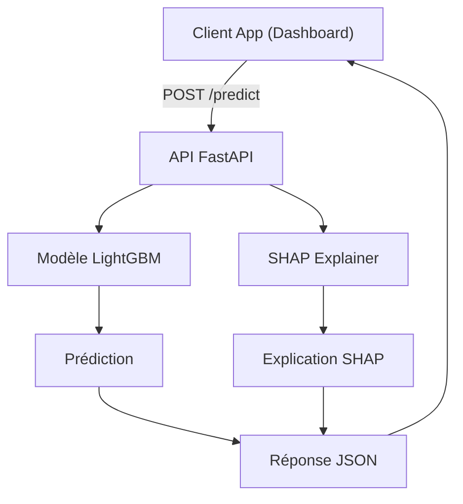

# ⚙️ Backend API - Scoring de Crédit (FastAPI)

## 🎯 Objectif
Ce backend expose une API REST développée avec **FastAPI**. Il permet de :
- Recevoir des données clients au format JSON.
- Retourner une prédiction de risque de défaut.
- Fournir une explication locale (SHAP values).

Ce backend est destiné à être consommé par le dashboard Streamlit 

## 🧩 Vue d’ensemble


---
(dossier `frontend/`)


## 📁 Structure du dossier
```
backend/
├── main.py # Point d'entrée de l'API
├── model.py # Chargement du modèle et logique de prédiction
├── generate_api_key.py # Génère une clé API pour sécuriser les requêtes
├── models/
│ └── lightgbm_production_artifact_*.pkl # Modèle entraîné (LightGBM)
├── data/
│ └── test_2000_sample_for_api.csv # Exemple de données pour tester l'API
├── tests/
│ ├── test_config.py # Test de la configuration
│ └── test_sanity.py # Test simple de l'API
├── requirements.txt # Dépendances spécifiques au backend
└── README.md # Ce fichier
```
---

## ▶️ Lancement local de l’API

Depuis la racine du projet :

```bash
cd backend
uvicorn main:app --reload --port 8000
```
L'API est alors disponible à l'adresse : http://127.0.0.1:8000

---
## 🔐 Authentification (clé API)

- L’API est protégée via une clé transmise dans l'en-tête HTTP :

```http
X-API-KEY: votre_clé
```

- Pour générer une nouvelle clé API :
```
python generate_api_key.py
```
## ✅ Tests unitaires
```bash
pytest
```

## 📦 Dépendances

```text
backend/requirements.txt
```

