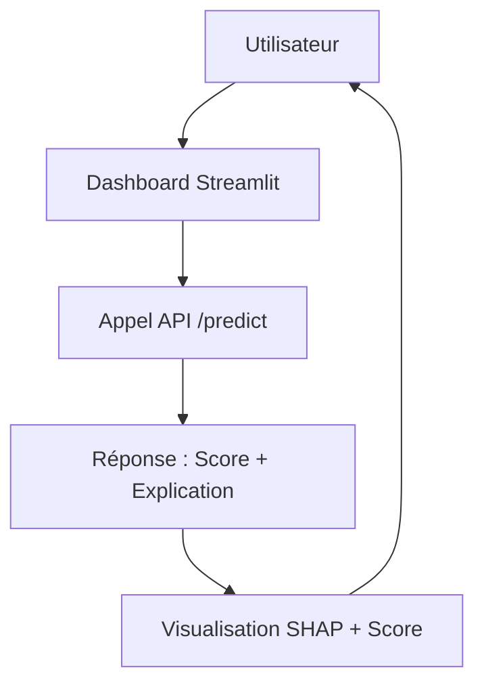

# 🖥️ Dashboard Client - Frontend (Streamlit)

## 🎯 Objectif
Ce dashboard permet aux conseillers clientèles d’évaluer le risque de défaut pour un client en temps réel. Il offre :
- un score de risque sous forme de jauge visuelle,
- une interprétation des principales variables via SHAP,
- un affichage clair des données clients.

L’application interagit dynamiquement avec l’API FastAPI du dossier `backend`.

## 🧩 Vue d’ensemble


---

(dossier `backtend/`)

## 📁 Structure du dossier
```
frontend/
├── app.py                         # Script principal Streamlit
├── config.py                      # Configuration de l'URL de l'API, clés, etc.
├── assets/
│   └── logo-projet-fintech.png    # Logo utilisé dans l'interface
├── utils/
│   ├── api_requests.py            # Appels à l'API FastAPI
│   ├── definition.py              # Définitions des variables
│   ├── formatters.py              # Formattage des données
│   ├── shap_utils.py              # Traitement des valeurs SHAP
│   ├── styling.py                 # Couleurs, styles
│   ├── user_interactions.py       # Récupération des choix utilisateurs
│   └── visuals.py                 # Fonctions de visualisation graphique
├── tests/
│   ├── test_api_requests.py       # Test des appels à l'API
│   ├── test_config.py             # Test de la config
│   ├── test_formatters.py
│   ├── test_project
│   └── test_real_requests.py
│   └── __init__.py
├── requirements.txt               # Dépendances spécifiques au frontend
└── README.md                      # Ce fichier

```

---

## ▶️ Lancement local du dashboard

Depuis la racine du projet :

```bash
cd frontend
streamlit run app.py
```
- Le dashboard s’ouvre automatiquement dans votre navigateur par défaut.


## 🌐 Connexion à l’API

- L’URL de l’API est définie dans config.py. Pour un usage local :
```text
API_URL = "http://localhost:8000"
```
## 📦 Dépendances

- Toutes les dépendances nécessaires au frontend sont listées dans le fichier :
```text
frontend/requirements.txt
```

